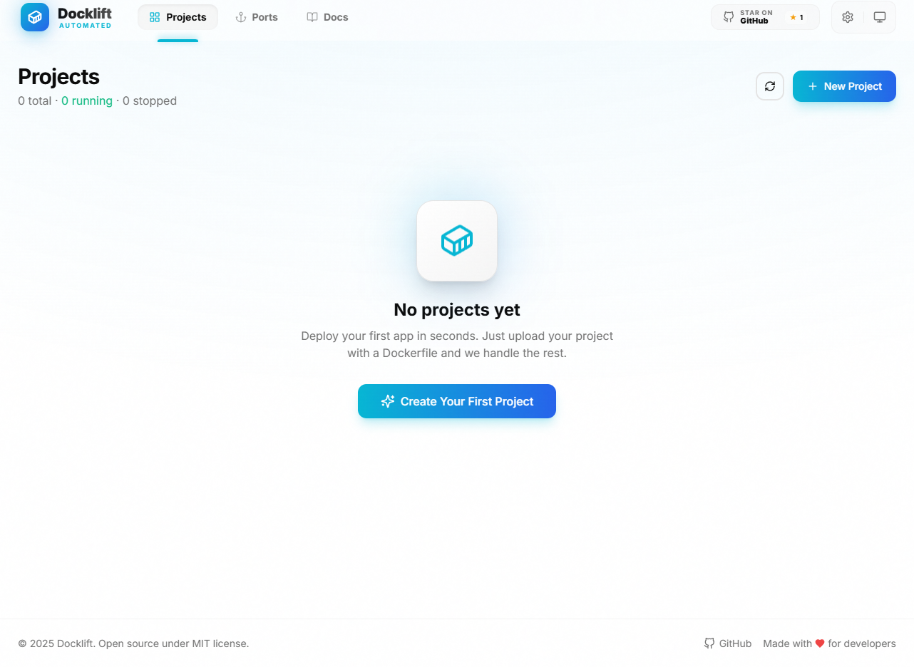
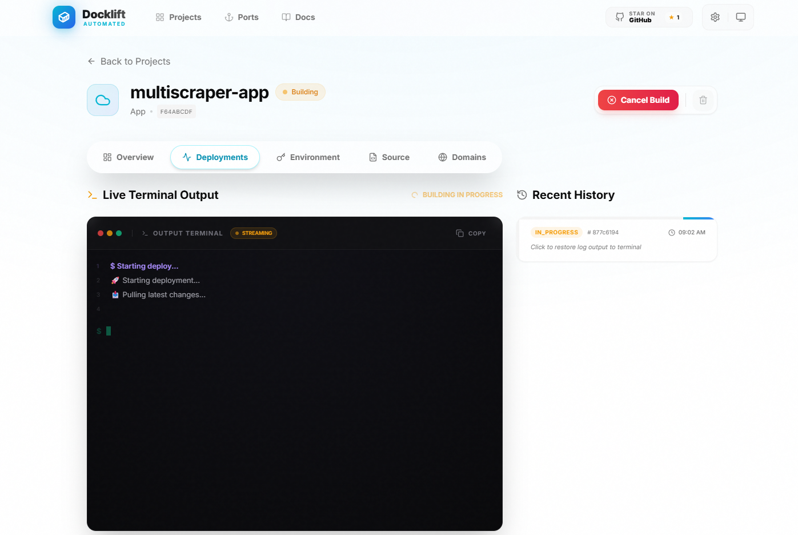

<p align="center">
  <a href="https://nextjs.org"></a>
  <a href="https://expressjs.com"></a>
  <a href="https://docker.com"></a>
  <a href="LICENSE"></a>
</p>

# 🐳 Docklift

**Docklift is an open-source & self-hostable alternative to Coolify / Dokploy / Heroku / Netlify / Vercel / etc.**

It helps you deploy and manage your applications on your own hardware - you only need a VPS with Docker installed. Deploy from GitHub or upload files directly, manage custom domains, monitor system resources, and access your server terminal - all from a beautiful web interface.

**Imagine having the ease of a cloud platform but on your own servers. That is Docklift.**

No vendor lock-in, which means all your application data, configurations, and Docker containers live on your server. If you decide to stop using Docklift, your apps keep running - you just lose the beautiful dashboard and automations. 🪄

---

> 🚀 **Self-hosted deployment platform** • Deploy Docker containers from GitHub or ZIP upload • Real-time build logs • Automatic port management • Custom domains • System monitoring • Web terminal • Built with Next.js 16 & Express



## ✨ Key Features

- **📦 One-Click Deployment** - Simply connect a GitHub repository or upload a ZIP file.
- **🐳 Docker Native** - Requires a `Dockerfile` in your project; Docklift generates `docker-compose.yml` automatically. 
- **🌐 Automatic Port Management** - No need to worry about port conflicts; Docklift handles them.
- **🔄 Zero-Downtime Redeploys** - Rebuild and restart containers seamlessly.
- **📜 Live Build Logs** - Watch your application build in real-time.
- **🐙 GitHub Integration** - Private repository support via GitHub Apps.
- **📊 System Monitoring** - Real-time CPU, RAM, GPU, disk, and network stats.
- **💻 Web Terminal** - Full SSH-like terminal access in your browser.



---

## 🆚 Why Docklift?

There are great tools out there like **Coolify**, **Dokploy**, **Dokku**, and **CapRover** - but they often come with a learning curve, complex configurations, or feel heavy for simple use cases. Docklift is built to be **lightweight, minimal, and easy to understand**. It focuses purely on Docker deployments without the bloat, while offering features others don't - like full **system monitoring** (CPU, RAM, GPU, disk, network) and a **web terminal** right in your browser. If you want to deploy Docker containers quickly without wrestling with configurations, Docklift is for you.

---

## 🛠️ Prerequisites

To run Docklift locally or on a server, you need:

1.  **Docker & Docker Compose** installed and running.
2.  **[Bun](https://bun.sh/)** (for local development) - Install with: `curl -fsSL https://bun.sh/install | bash`

---

## 🚀 Getting Started

### 1. One-Command Install (Recommended for Production)

Run this on your Ubuntu server to set up everything automatically:

#### Install

```bash
curl -fsSL https://raw.githubusercontent.com/SSujitX/docklift/master/install.sh | sudo bash
```

#### Uninstall

```bash
curl -fsSL "https://raw.githubusercontent.com/SSujitX/docklift/master/uninstall.sh?nocache=1" | sudo bash -s -- -y
```

### 2. Run with Docker Compose

The easiest way to run Docklift without development setup:

```bash
git clone https://github.com/SSujitX/docklift.git
cd docklift
docker compose up -d
```

Access the dashboard at: `http://localhost:3000`

---

## 💻 Local Development Setup

If you want to contribute or modify code, follow these steps:

### 1. Clone & Configure

```bash
git clone https://github.com/SSujitX/docklift.git
cd docklift

# Setup backend environment
cd backend
cp .env.example .env
```

### 2. Install Dependencies

```bash
# Backend (from /backend directory)
bun install

# Frontend (from /frontend directory)
cd ../frontend
bun install
```

### 3. Initialize Database (Required)

After installing dependencies, you **must** run these commands:

```bash
cd backend

# Generate Prisma client from schema
bun run db:generate

# Create/sync database tables
bun run db:push
```

> [!IMPORTANT]
> Run these commands after every fresh clone or when pulling new schema changes.

### 4. Start Development Servers

```bash
# Terminal 1 - Backend (runs on port 8000)
cd backend
bun run dev

# Terminal 2 - Frontend (runs on port 3000)
cd frontend
bun run dev
```

### 5. Useful Development Commands

| Command | Description |
|---------|-------------|
| `bun run dev` | Start development server |
| `bun run build` | Build for production |
| `bun run db:generate` | Regenerate Prisma client |
| `bun run db:push` | Push schema changes to DB |
| `bun run db:studio` | Open Prisma Studio GUI |

---

## 🐳 Deploying Your First App

1.  Open Docklift (`http://localhost:3000`).
2.  Click **"New Project"**.
3.  Choose a source:
    *   **Public GitHub**: Paste a repo URL.
    *   **Private GitHub**: Connect the Docklift GitHub App.
    *   **Direct Upload**: Upload a ZIP file of your code (must include a `Dockerfile`).
4.  Docklift will detect the branch (defaults to `main`).
5.  Click **Deploy**.
6.  Your app will be live at `http://localhost:<ASSIGNED_PORT>`.

---

## 📂 Project Structure Guide

Docklift is designed to be flexible. It automatically scans your project for `Dockerfile` files. 

### 1. Single-Service Project (Recommended for simple apps)
Use this for a standard Next.js, Python, or Go application.

```text
my-cool-app/
├── Dockerfile          <-- Required (at the root)
├── package.json        (or requirements.txt, main.go, etc.)
├── src/
└── ...
```

### 2. Multi-Service Project (Mono-repo style)
Docklift will detect each `Dockerfile` and create separate services for them within the same project.

```text
my-complex-app/
├── api/
│   ├── Dockerfile     <-- Service 1 (e.g. FastAPI)
│   ├── main.py
│   └── requirements.txt
├── dashboard/
│   ├── Dockerfile     <-- Service 2 (e.g. Next.js)
│   ├── package.json
│   └── ...
└── README.md
```

> [!TIP]
> **Docklift Tip**: Each subdirectory containing a `Dockerfile` becomes an independent container with its own internal port and optional custom domain.

---

## 🤝 Contributing

Contributions are welcome! Please open an issue to discuss proposed changes or features.

## 📄 License

MIT License - see [LICENSE](LICENSE)

***

**Made with ❤️ for developers who take control.**


## Star History

[](https://www.star-history.com/#SSujitX/docklift&type=date&legend=top-left)

