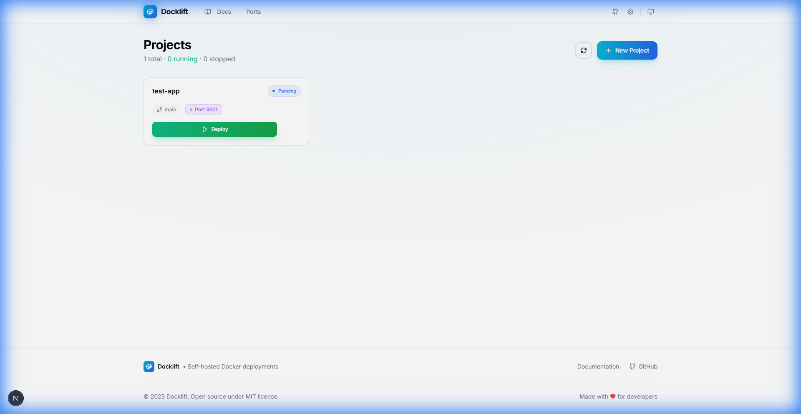

# 🐳 Docklift

**Open-source, self-hosted PaaS for Docker deployments.** Deploy any application to your own server with one click. A free alternative to Heroku, Vercel, and Netlify. Similar to Coolify, CapRover, and Dokku.

[](https://nextjs.org)
[](https://fastapi.tiangolo.com)
[](https://docker.com)
[](LICENSE)
[](https://github.com/SSujitX/docklift)

> 🚀 **Self-hosted deployment platform** • Deploy Docker containers from GitHub or file upload • Real-time build logs • Automatic port management • Built with Next.js 16 & FastAPI

## 🚀 Quick Install

```bash
curl -fsSL https://raw.githubusercontent.com/SSujitX/docklift/main/install.sh | sudo bash
```

Or manually:

```bash
git clone https://github.com/SSujitX/docklift.git
cd docklift
docker compose up -d
```

Access at `http://YOUR_SERVER_IP:8080`

---

## ✨ Features

- **📦 One-Click Deploy** - Upload your project or connect GitHub, click deploy
- **🐳 Docker Native** - Auto-generates Dockerfile and docker-compose.yml
- **📊 Real-time Logs** - Live terminal output during builds
- **🔄 Redeploy & Rollback** - Easy redeployment with container recreation
- **📁 File Editor** - Edit project files directly in the browser
- **🌐 Port Management** - Automatic port allocation and mapping
- **📜 Deployment History** - Track all deployments with logs

## 🛠️ Tech Stack

| Component | Technology |
|-----------|------------|
| Frontend | Next.js 16, React 19, Tailwind CSS |
| Backend | FastAPI, SQLAlchemy, Python |
| Database | SQLite (via aiosqlite) |
| Containers | Docker, Docker Compose |

## � Screenshots

| Dashboard | Project View |
|-----------|--------------|
|  |  |

## 🐳 Deploy Your First App

1. Click **"New Project"**
2. Upload your project files (with Dockerfile) or connect GitHub
3. Click **"Deploy"**
4. Watch the build in real-time
5. Access your app at `localhost:PORT`

## 🔧 Configuration

| Variable | Default | Description |
|----------|---------|-------------|
| `DOCKLIFT_PORT_RANGE_START` | 3001 | Starting port for projects |
| `DOCKLIFT_PORT_RANGE_END` | 3100 | Ending port for projects |
| `DOCKLIFT_DOCKER_NETWORK` | docklift_network | Docker network name |

## 💻 Development

```bash
# Backend
cd backend
uv sync
uv run uvicorn app.main:app --host 0.0.0.0 --port 8000

# Frontend (new terminal)
cd frontend
npm install
npm run dev
```

## 📁 Project Structure

```
docklift/
├── backend/              # FastAPI backend
│   ├── app/
│   │   ├── routes/       # API endpoints
│   │   ├── services/     # Docker, compose, git services
│   │   └── models/       # SQLAlchemy models
│   └── deployments/      # Deployed project files
├── frontend/             # Next.js frontend
│   ├── app/              # App router pages
│   └── components/       # UI components
├── docker-compose.yml    # Production deployment
├── install.sh            # One-liner installer
└── nginx.conf            # Nginx configuration
```

## 🤝 Contributing

PRs welcome! Please open an issue first to discuss changes.

## 📄 License

MIT License - see [LICENSE](LICENSE)

---

**Made with ❤️ for developers who want to self-host**
