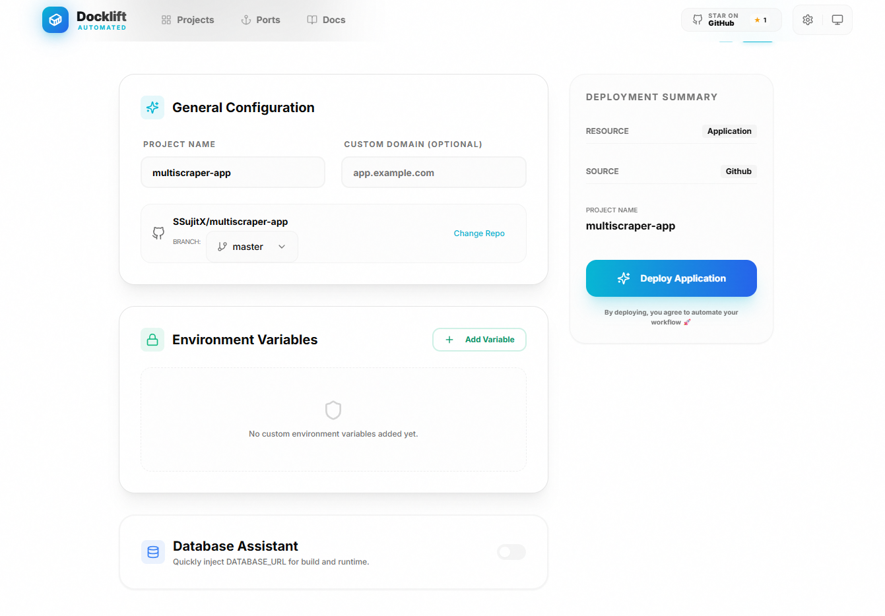

<h1 align="center">🐳 Docklift</h1>

<p align="center">
  <strong>Self-hosted Docker deployment platform</strong><br>
  Open-source alternative to Coolify, Dokploy, Dokku, CapRover, Vercel, Netlify & Heroku.
</p>

<p align="center">
  <a href="https://github.com/SSujitX/docklift/stargazers"></a>
  <a href="https://github.com/SSujitX/docklift/releases"></a>
  <a href="https://nextjs.org"></a>
  <a href="https://expressjs.com"></a>
  
</p>

<p align="center">
  <a href="#-quick-start">Quick Start</a> •
  <a href="#-features">Features</a> •
  <a href="#-commands">Commands</a> •
  <a href="#-contributing">Contributing</a>
</p>

---

## 📖 What is Docklift?

Docklift lets you deploy and manage Docker containers on your own server with a beautiful web UI. Connect GitHub repos or upload files, get auto-deployments, custom domains, and full system monitoring — without vendor lock-in.

**Your server. Your rules. Your apps.**



---

## 🆚 Why Docklift?

There are great tools out there like **Coolify**, **Dokploy**, **Dokku**, and **CapRover** — but they often come with a learning curve, complex configurations, or feel heavy for simple use cases. 

Docklift is built to be **lightweight, minimal, and easy to understand**. It focuses purely on Docker deployments without the bloat, while offering features others don't — like full **system monitoring** (CPU, RAM, GPU, disk, network) and a **web terminal** right in your browser. 

If you want to deploy Docker containers quickly without wrestling with configurations, **Docklift is for you**.

---

## 📑 Table of Contents

- [Quick Start](#-quick-start)
- [Why Docklift](#-why-docklift)
- [Features](#-features)
- [Installation](#-installation)
- [Development Setup](#-development-setup)
- [Deploy Your First App](#-deploy-your-first-app)
- [Commands Reference](#-commands-reference)
- [Contributing](#-contributing)
- [License](#-license)


---

## 🚀 Quick Start

One-command install on Ubuntu/Debian:

```bash
curl -fsSL https://raw.githubusercontent.com/SSujitX/docklift/master/install.sh | sudo bash
```

Access your dashboard at `http://your-ip:8080`

---

## ✨ Features

| Feature | Description |
|---------|-------------|
| 📦 **One-Click Deploy** | Push code → Docklift builds & runs it |
| 🐙 **GitHub Integration** | Connect private repos via GitHub Apps |
| 🔄 **Auto-Deploy** | Webhook-triggered redeploys on push |
| 🌐 **Custom Domains** | Automatic Nginx proxy & SSL ready |
| 📊 **System Monitoring** | CPU, RAM, GPU, disk & network stats |
| 💻 **Web Terminal** | SSH-like access in your browser |
| 📜 **Live Build Logs** | Real-time streaming output |
| 🔐 **Env Variables** | Secure build-time & runtime secrets |

---

## 📦 Installation

### Production (Recommended)

**Install:**
```bash
curl -fsSL https://raw.githubusercontent.com/SSujitX/docklift/master/install.sh | sudo bash
```

**Upgrade (preserves data):**
```bash
curl -fsSL https://raw.githubusercontent.com/SSujitX/docklift/master/upgrade.sh | sudo bash
```

**Uninstall:**
```bash
curl -fsSL https://raw.githubusercontent.com/SSujitX/docklift/master/uninstall.sh | sudo bash -s -- -y
```

### Docker Compose

```bash
git clone https://github.com/SSujitX/docklift.git
cd docklift
docker compose up -d
```

---

## 💻 Development Setup

**Prerequisites:** Docker, [Bun](https://bun.sh/)

**Clone & setup:**
```bash
git clone https://github.com/SSujitX/docklift.git
cd docklift
```

**Backend:**
```bash
cd backend && cp .env.example .env
bun install
bun run db:generate && bun run db:push
bun run dev
```

**Frontend (new terminal):**
```bash
cd frontend && bun install && bun run dev
```

**Dev URLs:** Frontend `localhost:3000` | Backend `localhost:4000`

---

## 🐳 Deploy Your First App

1. Open Docklift → Click **New Project**
2. Choose source: GitHub URL, Private Repo, or ZIP Upload
3. Add environment variables (optional)
4. Click **Deploy** → Watch live build logs
5. Access at `http://your-ip:<assigned-port>`

> **Requirement:** Your project must have a `Dockerfile`

---

## 📋 Commands Reference

### 🔍 Logs

| Command | Description |
|---------|-------------|
| `docker logs docklift-backend -f` | Backend logs |
| `docker logs docklift-frontend -f` | Frontend logs |
| `docker logs docklift-nginx-proxy -f` | Nginx proxy logs |
| `docker ps --filter name=dl_` | List project containers |

### 🗄️ Database

| Command | Description |
|---------|-------------|
| `bun run db:studio` | Open Prisma Studio GUI |
| `bun run db:push` | Push schema changes |
| `bun run db:generate` | Regenerate Prisma client |

### 🏷️ Versioning

| Command | Description |
|---------|-------------|
| `npm version patch` | 0.1.5 → 0.1.6 (bug fixes) |
| `npm version minor` | 0.1.5 → 0.2.0 (features) |
| `npm version major` | 0.1.5 → 1.0.0 (breaking) |

### 🧹 Cleanup

| Command | Description |
|---------|-------------|
| `for port in {3001..3050}; do sudo fuser -k ${port}/tcp 2>/dev/null; done` | Kill ports 3001-3050 |
| `cd backend && bun run reset-password` | Reset admin password |

> 📖 Full commands guide: [commands.md](commands.md)

---

## 🤝 Contributing

Contributions welcome! Please:

1. Fork the repo
2. Create a feature branch (`git checkout -b feature/amazing`)
3. Commit changes (`git commit -m 'feat: add amazing feature'`)
4. Push to branch (`git push origin feature/amazing`)
5. Open a Pull Request

### Commit Convention

```
feat:     New feature
fix:      Bug fix
docs:     Documentation
style:    Formatting (no code change)
refactor: Code restructure
test:     Add tests
chore:    Maintenance
```

---

## 📄 License

MIT License — see [LICENSE](LICENSE)

---

<p align="center">
  <b>Made with ❤️ for developers who take control</b>
</p>

<p align="center">
  <a href="https://www.star-history.com/#SSujitX/docklift&Date">
    
  </a>
</p>

<p align="center">
  
</p>